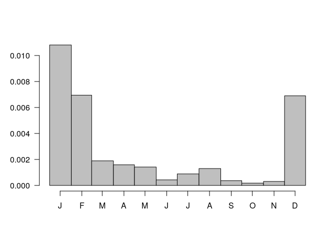
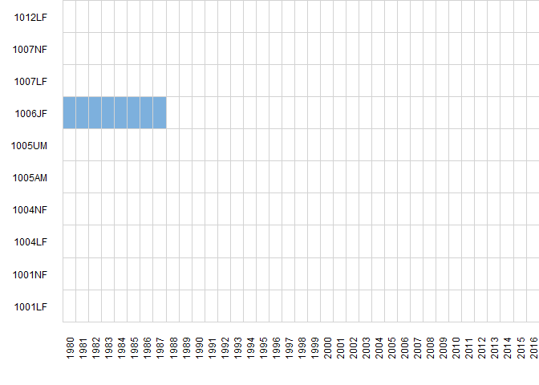
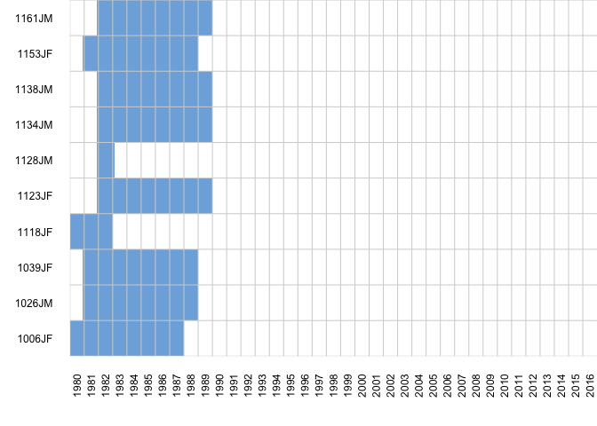
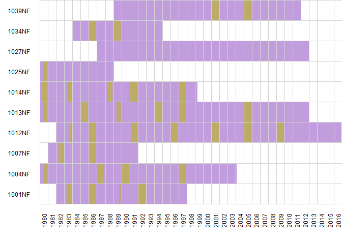
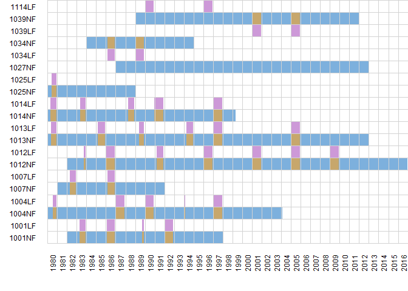
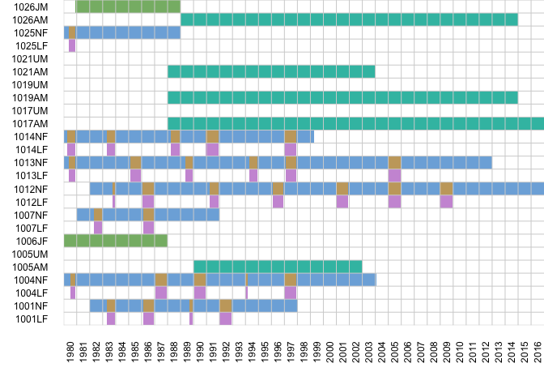
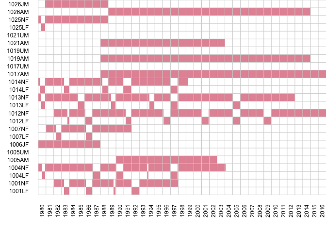

## how to use this document

1. See [Next Steps].

2. Pull to make sure you have the latest version

3. Make some edits to readme.Rmd.
    - readme.md is automatically generated and should not be edited by hand. any changes will be overwritten when readme.Rmd get re-knit.

4. Save

5. Knit
    - this will create readme.md and readme.html
    - readme.md will be automatically viewable when broswing the repo (https://github.com/williamcioffi/egsocial)

6. rename readme.html --> index.html (in file folder structure on your computer, delete the old "index.html" and then rename the "readme.html" to "index.html")
    - readme.html will not be automatically viewable until renamed to index.html it will be automatically viewable at https://williamcioffi.github.com/egsocial and all the fancy colors and floating table of contents will work.
    - _can this step be automated? (with a makefile?)_

7. Commit changes and push to github.

## Introduction

Baleen whales lack the strong and stable long-term bonds characteristic of odontocetes such as killer whales and sperm whales, and therefore, the social structure of baleen whales has received comparatively little attention. However, recent findings of long-term associations in both right whales and humpback whales have challenged the notion that baleen whale society is characterized by short and unstable associations. Previous research has used “within 2 body lengths” to define association, while recognizing that this definition underestimates the range at which whales interact acoustically. We take a new approach and define association in North Atlantic right whales based on communication range. We analyzed a rich dataset of 41,301 sightings of individually identified right whales from 1981-2009 throughout their geographic range. We calculated the mean and maximum association indices between and within age-sex classes (adult males, adult lactating females, adult non-lactating females, juvenile males, and juvenile females) and found significant preferred associations using permutation tests. Lactating females had the lowest rates of association across all age-sex classes as is common among mammals. The highest rates of association were found among juveniles with other juveniles, and adult males with other adult males. High rates of association among juveniles are common in mammals as the period between weaning and adulthood is important for the formation of social relationships and learning. The high rates of association among adult males are consistent with previous work on right whales and in contrast to associations in adult male humpback whales, likely due to differences in the mating systems of the two species. These results are consistent with our current understanding of right whale social structure using the “within 2 body lengths” definition of association and support the hypothesis that right whales are interacting acoustically at ranges out to at least 10 kilometers.

----

## Analysis Decisions


**numsamp** > 35

**distance** = 10km for most analysis 
(also looked at 0.03 "2 body lengths", 1km, 5km, 10km, 15km, 20km)

**sampling period:** use 'Day' (see Whitehead book p.79)

**swim speed** = 3.1 km/hr

**Mantel tests** : used "multiple measures" module to import the custom adjusted matrix

----

## Dataset Summary


* 719 individual right whales
* 65,827 sightings
* 1980-2016


----

## Data Request

Photographs of right whales and associated life history data were obtained from [The North Atlantic Right Whale Consortium](https://www.narwc.org/)

Phil Hamilton retrieved the data for this request on 11/6/2017 which consisted of 

65,827 sightings of individually identified right whales from 1980-2016

----

## Data Prep

### Inital Data Prep in Excel

**inputs**:  Kahn Data Request- data exported 2017-11-06.xlsx

**outputs**: 5-Khan-data-cleaned-up.csv

- open 'Kahn Data Request- data exported 2017-11-06.xlsx' and Save As in Excel file with a new name
- delete 'Calving Data' worksheet
- delete 'Code Explanation' worksheet
- delete top row header that says 'All sightings of identified whales from 1980 through 2016'
- highlight all and remove shading and borders   
- highlight top row and replace all spaces with nothing
- highlight all and replace all spaces with a period
- highlight all and replace all commas with a period
- highlight all and replace all double periods with a single period
- highlight all and replace all blanks with 'NA' values
- delete column "Association Id"
- delete column "Association Type"
- delete column "Singleton"
- delete column "Observer"
- delete column "Area Code"
- delete column "Letter"
- delete any whales (EGNo) of unknown gender 'X'
- moved "Latitude" and "Longitude" columns over to the left, and formatted to 5 decimal places
- insert a RID column for row names
- save
- save as a .txt file

### age and sex assignment {#rules}

**inputs**: 5-Khan-data-cleaned-up.csv, 2017-11-06-Khan-data-request-calving.csv

**outputs**: `birthdeath` and `dat` exported as RData files.

The following rules are used to determine the age and sex class of an individual over time:

1. retain records which have at least a day month year.
2. calves are excluded
3. you are a calf until December 1st of birth year and afterwards you will be a juvenile
4. considered an adult if:
    a. it has been nine years or more since known birth year
    b. OR eight years or more since date of first sighting (when birth year is unknown)
    c. OR Jan 1st of the year prior to giving birth to a calf
5. whales with a known birth year seen for less than eight years were excluded (unknown age class)
6. lactating:
    a. female are considered lactating from their first sighting with a dependent calf until dec 1st of the calving year.
    b. if a calf is lost; mother was considered lactating until the last sighting of calf, and non-lactating afterwards.


First, we'll load in the data and prepare the date formats and take a peak. `dat` is a table of sighting records, while 'cdat' is a table of calving years.


```r
### load input files
dat  <- read.table("../data/5-Khan-data-cleaned-up.csv", header = TRUE, sep = ',')
cdat <- read.table("../data/2017-11-06-Khan-data-request-calving.csv", header = TRUE, sep = ',')

head(dat)
```

```
##   RowNames Latitude Longitude EGNo Gender FirstYearSighted BirthYear
## 1        1 43.96667 -68.11667 1005      M             1982        NA
## 2        2 43.96667 -68.05500 1005      M             1982        NA
## 3        3 43.96667 -68.12833 1005      M             1982        NA
## 4        4 43.96667 -68.03333 1005      M             1982        NA
## 5        5 41.57500 -69.40333 1005      M             1982        NA
## 6        6 43.88833 -68.20667 1005      M             1982        NA
##   FirstCalvingYear Year Month Day Time Behaviors
## 1               NA 1982     8  26    0       SAG
## 2               NA 1984     9  13    0      <NA>
## 3               NA 1984     9  22    0       SAG
## 4               NA 1985     9  12    0      <NA>
## 5               NA 1988     5   9 1153      <NA>
## 6               NA 1989     9  16    0      <NA>
```

```r
head(cdat)
```

```
##   EGNo CalvingYear         CalfNo
## 1 1001        1983           1301
## 2 1001        1986           1603
## 3 1001        1989           1911
## 4 1001        1992           2201
## 5 1004        1980 1980CalfOf1004
## 6 1004        1987           1707
```


Next, we'll set up some well formatted dates and flag missing dates in the boolean `missingjustdate`.


```r
missingjustdate <- which(dat$Day == 0 | dat$Month == 0 | dat$Year == 0)

# format for hhmm and split into hh and mm
time_char <- sprintf("%04d", dat$Time)
time_hrs <- substring(time_char, 1, 2)
time_min <- substring(time_char, 3, 4)

# paste together and remove entries with no date
date <- paste0(dat$Year, "-", sprintf("%02d", dat$Month), "-", sprintf("%02d", dat$Day))
date[missingjustdate] <- NA
date <- as.Date(date)

# put records in temporal order including missing dates
oo1 <- order(dat$Time)
oo2 <- order(dat$Day[oo1])
oo3 <- order(dat$Month[oo1][oo2])
oo4 <- order(dat$Year[oo1][oo2][oo3])
oo <- oo1[oo2][oo3][oo4]

dat <- dat[oo, ]
date <- date[oo]
```

Now we can get started with assigning ages and sexes. First we'll make some temporary variables `ageclass_tmp` and `lactating_tmp`. These are both n records long so there is a designation for each sighting of an animal (dataframe, not currently exported) in `dat`. `ageclass_tmp` can be U[nknown], A[dult], J[uvenile], or calf. `lactating_tmp` can be "potentiallact" which is a placeholder when a potential mom is identified or L[actating].

We also create a couple of metrics to help with the agesexclass designations including `years_since_birth`, `years_since_sight` (first year sighted), and `years_since_1calf` (years since the first calving year) and save them to `dat`.


```r
ageclass_tmp  <- 1:nrow(dat) * NA
lactating_tmp <- 1:nrow(dat) * NA

# create new columns to help double check agesex classes
years_since_birth <- dat$Year - dat$BirthYear
years_since_sight <- dat$Year - dat$FirstYearSighted
years_since_1calf <- dat$Year - dat$FirstCalvingYear

dat[, 'yearminusbirthyear']    <- years_since_birth
dat[, 'yearminusfirstsight']   <- years_since_sight
dat[, 'yearminusfirstcalving'] <- years_since_1calf
```

Now we can apply a couple of simple rules about who is an adult. [Rule 5](#rules) is applied first. Animals are unknown ageclass if they have been seen less than 8 years since first sighting and we don't know a real birth year (would have had to be observed as a calf). Otherwise animals become adults in their ninth year of life.

An animals without a known birth year will be designated as an adult in the 8th year since first sighting. This is because the animal was not determined to be a calf upon first sighting (otherwise it would have a known birth year) and so at youngest it is at least 1 year old. In the case of first sighting as an at least 1 year old, this criteria would be exactly the same as the previous, that is, animals become adults in their nineth year of life, but it is in general conservative because animals may be first seen as adults as well and we make no attempt to distinguish between animals first sighted as 1 year olds versus potentially older ([Rules 4a,b](#rules)).

Finally, females will automatically be designated an adult the year before they gave birth to their first calf (if known) regardless of their real age, since they would've had to be sexually mature to become pregnant. ([Rule 4c](#rules))


```r
# make unknowns
ageclass_tmp[which(years_since_sight <= 8 & is.na(dat$BirthYear))] <- "U"

# apply adult rules
ageclass_tmp[which(years_since_birth >=  9)] <- "A"
ageclass_tmp[which(years_since_sight >=  8 & is.na(years_since_birth))]  <- "A"
ageclass_tmp[which(years_since_1calf >= -1)] <- "A"
```

Next we set up some provisional lactating and calf categories based on the behavior column in `dat`. These are going to be adjusted and filled in later.


```r
# calf and mom behaviors
calfbehs <- c("CALFW/MOM", "CALFOFUNPHMOM", "CALF", "CALFW/OTHERS(S)", "CALFW/UNPH")
mombehs  <- c("W/CALF", "W/CALFUNPH")

allbehs             <- strsplit(as.character(dat$Behaviors), "\\.")
calfs_bybehavior    <- sapply(allbehs, function(l) any(l %in% calfbehs))
calfs               <- calfs_bybehavior | (dat$BirthYear >= dat$Year)
moms                <- sapply(allbehs, function(l) any(l %in% mombehs))

# make moms and calves
ageclass_tmp[calfs] <- "calf"
lactating_tmp[moms] <- "potentiallact"
```

Calves become juveniles on December 1st of their birth year ([Rule 3](#rules))


```r
calfjuvcutoff <- paste0(dat$BirthYear, "-12-01")
calfjuvcutoff[is.na(dat$BirthYear)] <- NA
calfjuvcutoff <- as.Date(calfjuvcutoff)
ageclass_tmp[which(calfs & date >= calfjuvcutoff)] <- "J"
```

And finally, everyone else becomes a juvenile that doesn't have an assigned ageclass.


```r
ageclass_tmp[is.na(ageclass_tmp)] <- "J"
```

Now we have to go through each mom-calf pair by pair, look for the first sighting, and apply the lactation [rules (6a,b)](#rules). In the loop we are also making an improved `cdat` which has each mom-calf pair and the first and last days seen together. This `cdat` will be used later when we are making a day by day availability matrix for calculating association indices. Note that the last day of lactation will be either December 1st (presumed weaning) or the day of last calf sighting before an inferred death (loss) of calf and so in most cases the end of lactation is somewhat arbitrary.


```r
first_lactday_tmp <- vector(mode = "character", length = nrow(cdat))
last_lactday_tmp  <- vector(mode = "character", length = nrow(cdat))
lost_lactday_tmp <- vector(length = nrow(cdat))

for(m in 1:nrow(cdat)) {
	calfyear <- cdat$CalvingYear[m]
	calfyear_early <- calfyear - 1
	mom <- cdat$EGNo[m]
	
	# find that mom and that calfyear (and the year before)
	dese <- (dat$EGNo == mom & (dat$Year == calfyear | dat$Year == calfyear_early))
	
	# get rid off entries that have no year, month, or day
	dese <- dese & !is.na(date)
	
	lactating_st <- min(which(lactating_tmp[dese] == "potentiallact"))
	
	if(lactating_st != Inf) {
		calfjuvcutofflate <- paste0(calfyear, "-12-01")
		calfjuvcutofflate <- as.Date(calfjuvcutofflate)
		
		lactating_en <- max(which(date[dese] < calfjuvcutofflate))
		
		# save these for later to incorporate into cdat
		# start off with december 1 as last lactday, but if calf dies update to earlier
		first_lactday_tmp[m] <- as.character(date[dese][lactating_st])
		last_lactday_tmp[m]  <- as.character(max(date[dese]))
		
		lostcalf <- grep("LOST", allbehs[dese])
		if(length(lostcalf) != 0) {
			lostcalf_index <- max(lostcalf)
			lostcalf_date <- as.Date(date[dese][lostcalf_index]) + 1
			lactating_en <- max(which(date[dese] < lostcalf_date))
			
			# update last_lactday
			last_lactday_tmp[m] <- as.character(date[dese][lostcalf_index])
			lost_lactday_tmp[m] <- TRUE
		}
		lactating_tmp[dese][lactating_st:lactating_en] <- "L"
	}
}

# add in additional information to cdat
cdat[, 'first_lactday'] <- first_lactday_tmp
cdat[, 'last_lactday'] <- last_lactday_tmp
cdat[, 'lost_lactday'] <- lost_lactday_tmp

# remove "potentiallact" temporary designation
lactating_tmp[lactating_tmp == "potentiallact"] <- NA

dat[, 'lactating'] <- lactating_tmp
dat[, 'ageclass'] <- ageclass_tmp
```

Now we have lactating and age-sex class categories assigned and integrated into the `dat` table. Next we can paste together the sex from `dat` with `ageclass` to create an agesex class. "AF" is changed to "NF" to indicate non-lactating. We paste ID number and agesex class together and add this as a field to the `dat` table.


```r
agesexid_tmp <- paste0(ageclass_tmp, dat$Gender)
agesexid_tmp[agesexid_tmp == "AF" & lactating_tmp == "L"] <- "LF"
agesexid_tmp[agesexid_tmp == "AF"] <- "NF"

dat[, 'agesexid'] <- paste0(dat$EGNo, agesexid_tmp)
```

Before proceeding we do a quick check to make sure there are no typos in `BirthYear` and `FirstYearSighted` and there should be only one unique value for each animal for both values. Watch out for the multinegative logic.


```r
dat_list <- split(dat, dat$EGNo)

stopifnot(!any(sapply(dat_list, function(l) length(unique(l$BirthYear))) != 1))
stopifnot(!any(sapply(dat_list, function(l) length(unique(l$FirstYearSighted))) != 1))
```

Now, we'll make a table of birthdays, first sightings, and deaths and save it as an intermediate output. Deaths are calculated two ways:

1. a behavior code of "DEAD" in `dat` can indicate a sighting of a deceased animal

2. an animal is assumed to be dead if not seen for 6 consecutive years.


```r
# make births and first
uids <- sort(unique(dat$EGNo))
nids <- length(uids)

births <- sapply(dat_list, function(l) unique(l$BirthYear))
firsts <- sapply(dat_list, function(l) unique(l$FirstYearSighted))

# look for deaths
deadcodes <- grep("DEAD", allbehs)
dat[, 'date'] <- date
dat_deads <- dat[deadcodes, ]
dat_deads_list <- split(dat_deads, dat_deads$EGNo)
deaths_tmp <- do.call('c', lapply(dat_deads_list, function(l) min(l$date)))

deaths <- vector(mode = "character", length = nids)
deaths[1:length(deaths)] <- NA
deaths[match(names(deaths_tmp), uids)] <- as.character(deaths_tmp)

# calculate deaths using the 6 year rule
lasts <- sapply(dat_list, function(l) max(l$Year, na.rm = TRUE))
lastsdeath <- lasts + 6
lastsdeath[!is.na(lastsdeath)] <- paste0(lastsdeath[!is.na(lastsdeath)], "-01-01")

# kill if we know a real death date
lastsdeath[!is.na(deaths)] <- NA

# combine lastsdeath and deaths
deathdates <- lastsdeath
deathdates[is.na(lastsdeath)] <- deaths[is.na(lastsdeath)]
```

We'll bundle all these fields up into a data frame to export as RData called `birthdeath`, because it is a summary of that sort of information for each animal. This is the first main output of this section of code. The second is the prepared `data.frame` called `dat`. Finally, we'll use `cdat` and `date` again so those'll be saved as well.


```r
birthdeath <- data.frame(
  EGNo = uids,
  birthyear = births,
  firstyearsighted = firsts,
  lastyearsighted = lasts,
  lastsighteddeath = lastsdeath,
  knowndeathdate = deaths,
  deathdates = deathdates,
stringsAsFactors = FALSE)

# take a peak
head(birthdeath)
```

```
##      EGNo birthyear firstyearsighted lastyearsighted lastsighteddeath
## 1001 1001        NA             1978            1992       1998-01-01
## 1004 1004        NA             1975            2004             <NA>
## 1005 1005        NA             1982            1997       2003-01-01
## 1006 1006      1979             1979            1986       1992-01-01
## 1007 1007        NA             1977            1986       1992-01-01
## 1012 1012        NA             1978            2016       2022-01-01
##      knowndeathdate deathdates
## 1001           <NA> 1998-01-01
## 1004     2004-02-07 2004-02-07
## 1005           <NA> 2003-01-01
## 1006           <NA> 1992-01-01
## 1007           <NA> 1992-01-01
## 1012           <NA> 2022-01-01
```

We remove the calves from `dat` since we don't want to calculate their association indices (since they are dependent on their mother's movements). Save the table for future use.


```r
dat <- dat[dat$ageclass != "calf", ]
```

We'll save all three intermediate tables.


```r
save(dat, cdat, birthdeath, date, file = "../data/agesex_assigned.RData")
```


### calculate day by day availability

The goal here is to create an ID x day matrix indicating availability for each ID, that is whether animals were "alive" on that day and therefore available to associate with others. We call that `nax_avail` by analogy with `nax` in [socprog](http://whitelab.biology.dal.ca/SOCPROG/social.htm). Note that there are more rows than individuals in this matrix because we are treating separately the same animal when lactating versus not for instance (the same female could be coded as JF, LF, and NF). This is a similar solution to that used by Ramp et al (2010).

What we've done here ignores any unknown age ids: UM, UF. UU, AU, and JU should have already been removed at this stage.

The rules for assigning age and sex classes are the same as above with the following adjustment made necessary by the day by day analysis:

Lactating females are lactating from the first day they are seen with a calf until 30-Nov of the calf cohort year or until the last sighting of the mom and calf before a LOST code in the behavior. This could be modified if for instance a standard start day for lactation is preferable within the calving year.

First let's just take a quick look at the distribution of first sightings of calves.


```r
monthstarts <- as.POSIXlt(
  seq.POSIXt(
    as.POSIXct("1980-01-1", tz = "UTC"), 
    as.POSIXct("1980-12-30", tz = "UTC"), 
  by = "month")
)$yday

hist(as.POSIXlt(cdat$first_lactday, tz = "UTC")$yday, 
   breaks = c(monthstarts, 365), 
   xaxt = 'n', 
   las = 1, xlab = "",
   ylab = "",
   col = "grey75",
   main = ""
)
axis(1, at = monthstarts + 15, 
   lab = c("J", "F", "M", "A", "M", "J", "J", "A", "S", "O", "N", "D")
)
```

<!-- -->

This looks fairly reasonable and to be expected. There probably isn't a good way with this data set to distinguish between late first sightings of calfs due to late births versus other causes (for instance missed observations or females giving birth outside of the normal study area). One potential would be to use size estimates of calves to approximate birthdays (and therefore start of lactation) but this might be a lot of work and harder to do with older data. In a sense it doesn't matter too much for what we are doing here because we are most concerned with periods for which there are observations of these individuals.

We can use a quick helper function below to visualize `nax` and do some simple error spot checking.


```r
naxlook <- function(nax, 
  nids = nids,
  ny = nyears, 
  uids = uids, 
  uy = uyears, 
  ylabs = TRUE, 
  xgrid = TRUE, 
  ygrid = TRUE, 
  ...
) {
require(colorspace)
par(mar = rep(0, 4), oma = c(4.1, 4.1, 0, 0))
image(t(nax), axes = FALSE, col = c("white", rainbow_hcl(max(nax))), ...)
plotdims <- par()$usr

xseq <- seq(plotdims[1], plotdims[2], len = ndates)[seq(1, ndates, by = 365)]
xinc <- xseq[2] - xseq[1]
xats <- xseq[1: ny] + xinc/2

yseq <- seq(plotdims[3], plotdims[4], len = nrow(nax) + 1)
yinc <- yseq[2] - yseq[1]
yats <- yseq[1:nrow(nax)] + yinc/2

axis(1, at = xats, labels = uy, las = 2, tick = FALSE, cex.axis = 0.75)

if(xgrid)
  abline(v = xseq, col = "lightgrey")
if(ygrid)
  abline(h = yseq, col = "lightgrey")

if(ylabs)
  axis(2, at = yats, labels = rownames(nax), las = 2, tick = FALSE, cex.axis = 0.75)	
}
```

We'll set some constants to help as we build up `nax_avail` one step at a time. In the end `nax_avail` will be converted to a binary matrix. `KILLVALUE` will be cells which should be removed from the final matrix (set to 0) and `ADDVALUE` will be cells which should be retained (set to 1) in the final matrix.


```r
KILLVALUE <- 2
ADDVALUE  <- 3
```

Some more set up to get things into convenient formats and generate an empty `nax_avail`.


```r
stdate <- as.POSIXct(paste0(format(min(date, na.rm = TRUE), "%Y"), "-01-01 00:00:00"), tz = "UTC")
endate <- as.POSIXct(paste(max(date, na.rm = TRUE), "00:00:00"), tz = "UTC")

udates <- as.Date(seq.POSIXt(stdate, endate, by = "day"))
ndates <- length(udates)

uyears <- unique(format(udates, "%Y"))
nyears <- length(uyears)

ids    <- dat$agesexid
uids   <- sort(unique(ids))
nids   <- length(uids)

agesex <- substring(uids, 5, 6)
age    <- substring(agesex, 1, 1)
sex    <- substring(agesex, 2, 2)

nax_avail <- matrix(0, nids, ndates)
rownames(nax_avail) <- uids
colnames(nax_avail) <- as.character(udates)

shortid  <- substring(uids, 1, 4)
ushortid <- unique(shortid)
nshortid <- length(ushortid)
```

The rest of the procedure here is going through different agesex classes one by one and catching transitions to other classes correctly. First, we'll start with juveniles. Basically we loop through all the juveniles. Figure out their birth, first year sighted, and death year if they exist and then assign them to be juveniles for all the days in between first sighting as a juvenile and either their death or their maturity. If they are females we check to see if they have had a calf and transition them to adults that way.


```r
js <- which(age == "J")
nj <- length(js)

for(i in 1:nj) {
  sid <- shortid[js][i]
  birthyear <- birthdeath[match(shortid[js][i], birthdeath$EGNo), 'birthyear']
  firstyear <- birthdeath[match(shortid[js][i], birthdeath$EGNo), 'firstyearsighted']
  deathdate <- birthdeath[match(shortid[js][i], birthdeath$EGNo), 'deathdates']

  if(is.na(birthyear)) {
    stdate <- as.Date(paste0(firstyear, "-01-01"))
    endate <- as.Date(paste0(firstyear + 7, "-12-31"))
  } else {
    stdate <- as.Date(paste0(birthyear, "-12-01"))
    endate <- as.Date(paste0(birthyear + 8, "-12-31"))
  }

  if(sex[js][i] == "F") {
    firstcalving <- min(cdat[match(shortid[js][i], cdat$EGNo), 'CalvingYear'])
    if(!is.na(firstcalving)) {
      adultcalving <- as.Date(paste0(firstcalving - 1, "-01-01"))
      if(endate > adultcalving) {
        endate <- adultcalving
      }
    }
  }

  st <- min(which(udates >= stdate), na.rm = TRUE)
  en <- max(which(udates <= endate), na.rm = TRUE)

  deathdate <- max(which(udates < deathdate))

  if(en > deathdate) {
    en <- deathdate - 1
  }

  if(en >= st) {
    nax_avail[js[i], st:en] <- ADDVALUE
  }
}
```

We can take a peak with `naxlook` to see if this has generated the desired effect. Let's just look at the first 10 individuals.


```r
naxlook(nax_avail[1:10, ])
```

```
## Loading required package: colorspace
```

<!-- -->

And now just the first 10 juveniles:


```r
naxlook(nax_avail[js[1:10], ])
```

<!-- -->

Next are adult males. These are the most straightforward since all we have to worry about is birthday, first sighting, and death day.


```r
ms <- which(age == "A")
nm <- length(ms)

for(i in 1:nm) {
  sid <- shortid[ms][i]
  birthyear <- birthdeath[match(shortid[ms][i], birthdeath$EGNo), 'birthyear']
  firstyear <- birthdeath[match(shortid[ms][i], birthdeath$EGNo), 'firstyearsighted']
  deathdate <- birthdeath[match(shortid[ms][i], birthdeath$EGNo), 'deathdates']

  if(is.na(birthyear)) {
    stdate <- as.Date(paste0(firstyear + 8, "-01-01"))
  } else {
    stdate <- as.Date(paste0(birthyear + 9, "-01-01"))
  }

  st <- min(which(udates >= stdate), na.rm = TRUE)
  en <- max(which(udates < deathdate), na.rm = TRUE)

  if(en >= st) {
    nax_avail[ms[i], st:en] <- ADDVALUE + 1
  }
}
```

Next, non lactating females. This loop is a little different than the previous two because we'll take our cue from the JF for where to start if one exists.

Also, we'll use a temporary `ADDVALUE + 2` to indicate that these entries are provisional. What we've done here is set the whole period a female is adult to non lactating and then in the next loop we'll identify lactating periods and go back and remove those times from the non lactating ID.


```r
ns <- which(age == "N")
nn <- length(ns)

for(i in 1:nn) {
  sid <- shortid[ns][i]
  birthyear <- birthdeath[match(shortid[ns][i], birthdeath$EGNo), 'birthyear']
  firstyear <- birthdeath[match(shortid[ns][i], birthdeath$EGNo), 'firstyearsighted']
  deathdate <- birthdeath[match(shortid[ns][i], birthdeath$EGNo), 'deathdates']

  jfmatch <- match(paste0(sid, "JF"), uids)
  if(!is.na(jfmatch)) {
    st <- max(which(nax_avail[jfmatch, ] != 0)) + 1
  } else {
    if(is.na(birthyear)) {
      stdate <- as.Date(paste0(firstyear + 8, "-01-01"))
    } else {
      stdate <- as.Date(paste0(birthyear + 9, "-01-01"))
    }

    firstcalving <- min(cdat[match(shortid[ns][i], cdat$EGNo), 'CalvingYear'])
    if(!is.na(firstcalving)) {
      adultcalving <- as.Date(paste0(firstcalving - 1, "-01-01"))
      if(stdate > adultcalving) {
        stdate <- adultcalving
      }
    }

    st <- min(which(udates >= stdate), na.rm = TRUE)
  }

  en <- max(which(udates < deathdate), na.rm = TRUE)

  if(en >= st) {
    nax_avail[ns[i], st:en] <- ADDVALUE + 2
  }
}
```

Let's take a quick look to see how this has worked. We'll look at these same individuals again after we've accounting for lactating females.


```r
naxlook(nax_avail[ns[1:10], ])
```

<!-- -->

Finally, we assign the lactating females. As mentioned above there is an extra step here where we go back and assign `KILLVALUE` to any corresponding non-lactating ID during lactation days. Lactating females are assigned `ADDVALUE + 3` really just to give them a different color of the `naxlook` plot and double check everything has worked as intended.


```r
lf <- which(age == "L")
ln <- length(lf)

for(i in 1:ln) {
  sid <- shortid[lf][i]
  dismom <- cdat[cdat$EGNo == sid, ]

  lactating <- vector()
  for(d in 1:nrow(dismom)) {
    st <- which(udates == dismom[d, 'first_lactday'])

    if(!dismom[d, 'lost_lactday']) {
      momlast <- as.Date(paste0(dismom[d, 'CalvingYear'], "-11-30"))
      en <- max(which(udates == momlast))
    } else {
      en <- which(udates == dismom[d, 'last_lactday'])
    }

    if(en >= st) {
      lactating <- c(lactating, st:en)
    }
  }

  if(length(lactating > 0)) {
    nax_avail[lf[i], lactating] <- ADDVALUE + 3

    # kill these days for the nf if it exists
    nfmatch <- match(paste0(sid, "NF"), uids)
    if(!is.na(nfmatch)) {
      nax_avail[nfmatch, lactating] <- KILLVALUE
    }
  }
}
```

Let's take another look at those same non-lactating females (purple) now. (lactating in yellow)


```r
naxlook(nax_avail[ns[1:10], ])
```

<!-- -->

And now with the corresponding lactating IDs (blue=non-lactating, purple/yellow=lactating):


```r
naxlook(nax_avail[c(rbind(ns[1:10], lf[1:10])), ])
```

<!-- -->

Everything should be accounted for now, let's look at the first 25 ids (green=adult males, blue=non-lactating females, purple/yellow lactating):


```r
naxlook(nax_avail[1:25, ])
```

<!-- -->

We can convert `nax_avail` into a binary matrix and take another look.


```r
nax_avail[which(nax_avail == KILLVALUE)] <- 0
nax_avail[which(nax_avail > 0)] <- 1

naxlook(nax_avail[1:25, ])
```

<!-- -->

----

## Next Steps

1. Christin: then double check that the age-sex classes have all been assigned correctly and ready to go:
    - Have dead whales been removed?
    - Have missing lat/long positions been removed?
    - Have records with missing times been removed?
    - Have whales of calves been removed?
    - Check calf/juv transition December 1
    - Double check unknowns at year 8
    - Double check lactation stages

2. Will: move over code to run social differentiation test and calculate the simple ratio


----

## References

Ramp C, Hagen W, Palsbøll P, Bérubé M, Sears R. 2010 Age-related multi-year associations in female humpback whales (_Megaptera novaeangliae_). Behav Ecol Sociobiol 64, 1563–1576. (doi:10.1007/s00265-010-0970-8)
